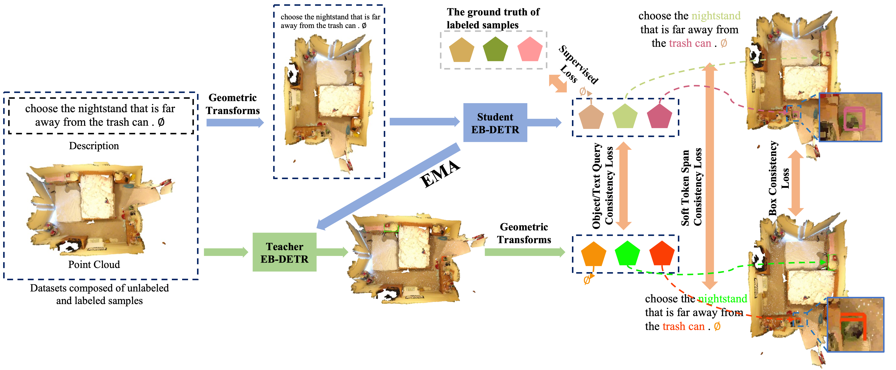

<!--
 * @Author: xushaocong
 * @Date: 2022-11-14 16:30:13
 * @LastEditTime: 2022-11-14 19:18:00
 * @LastEditors: xushaocong
 * @Description: 
 * @FilePath: /butd_detr/README.md
 * email: xushaocong@stu.xmu.edu.cn
-->
# RUSSO: 3D Reference Understanding Transformers with Less Boxes


Official implementation of 《RUSSO: 3D Reference Understanding Transformers with Less Boxes》




<!-- **Note:** -->

## Install

### Requirements
We showcase the installation for CUDA 11.1 and torch==1.10.2, which is what we used for our experiments.
If you need to use a different version, you can try to modify `environment.yml` accordingly.

- Install environment: `conda env create -f environment.yml --name russo`
- Activate environment: `conda activate russo`
- Install torch: `pip install -U torch==1.10.2 torchvision==0.11.3 --extra-index-url https://download.pytorch.org/whl/cu111`
- install extra package, `bash my_shell_scripts/install.sh`
- Compile the CUDA layers for [PointNet++](http://arxiv.org/abs/1706.02413), which we used in the backbone
  network: `sh init.sh`

### Data preparation

- Download ScanNet v2 data [HERE](https://github.com/ScanNet/ScanNet). Let `DATA_ROOT` be the path to folder that contains the downloaded annotations. Under `DATA_ROOT` there should be a folder `scans`. Under `scans` there should be folders with names like `scene0001_01`. We provide a script to download only the relative annotations for our task. Run `python scripts/download_scannet_files.py`. Note that the original ScanNet script is written for python2.

- Download ReferIt3D annotations following the instructions [HERE](https://github.com/referit3d/referit3d). Place all .csv files under `DATA_ROOT/refer_it_3d/`.

- Download ScanRefer annotations following the instructions [HERE](https://github.com/daveredrum/ScanRefer). Place all files under `DATA_ROOT/scanrefer/`.
- prepare the dataset directory tree referring to `my_shell_scripts/install2.sh`
<!-- - Download [object detector's outputs](https://drive.google.com/file/d/1OAArYe2NIfwSURiv6_ORbKAlYbOwfpVS/view?usp=sharing). Unzip inside `DATA_ROOT`. -->

- (optional) Download PointNet++ [checkpoint](https://drive.google.com/file/d/1JwMTOaMWfK0JgOBBHU_2oBGXp9ORo9Q3/view?usp=sharing) into `DATA_ROOT`.

- Run `python prepare_data.py --data_root DATA_ROOT` specifying your `DATA_ROOT`. This will create two .pkl files and has to only run once.

## Usage

- `bash my_shell_scripts/pretrain_cls.sh` to pretrain cls model (nr3d,sr3d) 
- `bash my_shell_scripts/train_cls.sh` to semi train cls model (nr3d,sr3d) 
- `bash my_shell_scripts/eval_cls.sh` to eval cls model 


- `bash my_shell_scripts/pretrain_det.sh` to pretrain det model (scanrefer) 
- `bash my_shell_scripts/train_det.sh` to semi train det model (scanrefer) 
- `bash my_shell_scripts/eval_det.sh` to eval det model 


- `Note: ` On NR3D and ScanRefer we need much more training epochs to converge. It's better to monitor the validation accuracy and decrease learning rate accordingly.

## Pre-trained checkpoints
`todo: ` 
<!-- Download our checkpoints for :[SR3D_det](https://zenodo.org/record/6430189/files/sr3d_butd_det_52.1_27.pth?download=1), [NR3D_det](https://zenodo.org/record/6430189/files/bdetr_nr3d_43.3.pth?download=1), [ScanRefer_det](https://zenodo.org/record/6430189/files/scanrefer_det_52.2.pth?download=1), [SR3D_cls](https://zenodo.org/record/6430189/files/bdetr_sr3d_cls_67.1.pth?download=1), [NR3D_cls](https://zenodo.org/record/6430189/files/bdetr_nr3d_cls_55.4.pth?download=1). Add `--checkpoint_path CKPT_NAME` to the above scripts in order to utilize the stored checkpoints. -->


Note that these checkpoints were stored while using `DistributedDataParallel`. To use them outside these checkpoints without `DistributedDataParallel`, take a look [here](https://discuss.pytorch.org/t/solved-keyerror-unexpected-key-module-encoder-embedding-weight-in-state-dict/1686).


## How does the evaluation work?
- For each object query, we compute per-token confidence scores and regress bounding boxes.
- Given a target span, we keep the most confident query for it. This is our model's best guess.
- We compute the IoU of the corresponding box and the ground-truth box.
- We check whether this IoU is greater than the thresholds (0.25, 0.5).


## Acknowledgements
Parts of this code were based on the codebase of  [BUTD-DETR](https://github.com/nickgkan/butd_detr) and   [Group-Free](https://github.com/zeliu98/Group-Free-3D). The loss implementation (Hungarian matching and criterion class) are based on the codebase of [MDETR](https://github.com/ashkamath/mdetr).


## Citing ROSSO
If you find RUSSO useful in your research, please consider citing:
```bibtex
```


<!-- ## License
The majority of BUTD-DETR code is licensed under CC-BY-NC, however portions of the project are available under separate license terms: [MDETR](https://github.com/ashkamath/mdetr) is licensed under the Apache 2.0 license; and [Group-Free](https://github.com/zeliu98/Group-Free-3D) is licensed under the MIT license. -->
